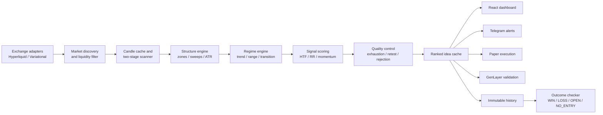

# SwiftChart

> Regime-aware crypto signal infrastructure that turns noisy perpetual-futures market data into ranked, risk-defined trade ideas.

SwiftChart is a mobile-first market intelligence platform for crypto traders. It continuously scans liquid perpetual markets, classifies the current market regime, evaluates long and short candidates, and publishes only setups that satisfy its quality and risk/reward controls.

The project is paper-first: signals are analysis outputs, not promises of profit, and live execution is disabled by default.

## The problem

Crypto traders often stitch together charts, screeners, alerts, spreadsheets, and exchange terminals while making time-sensitive decisions. Raw indicator alerts also tend to ignore context: the same pattern behaves differently in a trend, a range, a breakout, or exhausted price action.

SwiftChart solves this by providing one reproducible pipeline for:

- discovering liquid markets;
- separating actionable locations from mid-range noise;
- detecting regime and higher-timeframe bias before scoring a setup;
- producing explicit entry, stop, targets, invalidation, score, and position sizing;
- delivering the same analysis through web, API, Telegram, and paper-execution interfaces;
- preserving immutable signal records for outcome tracking.

## How SwiftChart works

1. **Discover markets.** Exchange adapters load active perpetual markets from Hyperliquid and, when configured, Variational.
2. **Filter for tradability.** Markets below the configured 24-hour perpetual-volume floor are excluded.
3. **Run the fast prefilter.** Volume, ATR-normalized volatility, range position, and chop checks reduce the market universe.
4. **Build market structure.** SwiftChart identifies swing highs/lows, support and resistance zones, range boundaries, EMA structure, and liquidity sweeps.
5. **Classify the regime.** The engine combines structure, trend strength, momentum, volatility, breadth, and score changes.
6. **Score both sides.** Candidate longs and shorts are evaluated for regime fit, zone quality, liquidity behavior, higher-timeframe alignment, RR, momentum, volume, and location.
7. **Apply quality controls.** Extended moves, momentum decay, distance from equilibrium, RSI exhaustion, and trap sweeps can reduce, defer, or reject a setup.
8. **Publish and track.** Qualifying ideas are ranked, cached, delivered to clients, saved as immutable history, deduplicated, and checked against later candles.

## Scoring system

Every candidate receives a normalized setup score from 0–100. The current scoring model allocates points across:

| Component | Maximum | What it measures |
|---|---:|---|
| Regime alignment | 18 | Whether the side fits the detected environment |
| Zone quality | 20 | Strength, reactions, touches, and recency |
| Liquidity sweep | 20 | Confirmed sweep/reclaim quality or trend continuation evidence |
| Higher-timeframe alignment | 15 | Agreement with 4H/1D context |
| Risk/reward | 10 | Reward available relative to invalidation distance |
| Momentum and volume | 10 | Follow-through and participation |
| Range location | 5 | Distance from low-quality mid-range entries |

Only ideas scoring **65/100 or higher** reach normal signal output. Scores of 80+ receive an `A+ Setup` grade. Automated Telegram subscriptions use a stricter 75+ threshold and require a `READY` entry state.

The score is not static. Regime confidence and exhaustion controls may penalize or cap a candidate, while counter-trend ideas require stronger reversal evidence. The default minimum RR is **2.0R**.

## Market regime detection

SwiftChart evaluates recent price structure alongside EMA alignment and slope, RSI, ADX, ATR, range compression, breakout confirmation, market breadth when available, and the change in regime score over the previous 12 candles.

The engine distinguishes:

- `RANGE_BOUND`
- `TRENDING_UP`
- `TRENDING_DOWN`
- `BREAKOUT`
- `BREAKDOWN`
- `CHOP`
- `TRANSITION_TO_BULLISH`
- `TRANSITION_TO_BEARISH`

Each regime snapshot includes a signed score, confidence, structure label, directional bias, transition state, explanation, bias-flip trigger, and one of `TRADE_ALLOWED`, `WAIT`, or `NO_TRADE`. Transition regimes deliberately require confirmation so the engine can react to structural change without flipping direction on every candle.

## Mobile-first design

SwiftChart is designed around the information a trader needs while away from a desktop:

- compact ranked opportunity cards;
- large direction, score, RR, and regime labels;
- entry, stop, and target levels readable without opening a chart;
- responsive navigation and dark mode;
- freshness, liquidity, maturity, and invalidation states;
- Telegram analysis and alert delivery using the same backend engine.

The desktop experience adds chart context and deeper history without changing the underlying signal model.

## Features

- Dynamic multi-exchange perpetual-market discovery
- Liquidity-aware universe filtering
- Two-stage cached scanner with rotating market windows
- Support/resistance zone scoring
- Liquidity sweep and reclaim detection
- Eight-state market regime engine
- Multi-timeframe confirmation using 4H and/or 1D context
- Long and short setup scoring with explicit reasons
- Exhaustion and late-entry protection
- Risk-based position sizing
- Ranked Top Ideas API and responsive dashboard
- Signal freshness and liquidity warnings
- Immutable trade history with duplicate suppression
- Outcome lifecycle: pending, entry, TP1, TP2, stop, expiry, invalidation, and ambiguity
- Conservative same-candle TP/SL handling
- Telegram analysis, Top 5, alerts, history, and statistics
- Paper-trading ledger and optional paper execution service
- GenLayer-assisted signal validation
- Rate limiting, webhook signing, secure logging, and live-trading safety gates

## Tech stack

| Layer | Technology |
|---|---|
| Frontend | React 19, Vite 6, Lightweight Charts, Lucide, MDX |
| API | Python, FastAPI, Pydantic |
| Analysis | pandas, NumPy, custom market-structure and risk modules |
| Data sources | Hyperliquid; optional Variational adapter |
| Storage | SQLite locally; Supabase/PostgreSQL-ready schemas |
| Messaging | python-telegram-bot |
| Validation | GenLayer JS/Python integration |
| Deployment | Vercel frontend/serverless entry, VPS + Nginx + PM2 workflow |
| Testing | pytest strategy, lifecycle, alert, liquidity, and execution suites |

## Architecture



### Repository layout

```text
.
├── api/                  # Serverless FastAPI entry
├── backend/
│   ├── app/
│   │   ├── exchanges/    # Market-data adapters
│   │   ├── routes/       # API surface
│   │   ├── services/     # Scanner, history, validation, execution
│   │   └── strategy/     # Regime, zones, sweeps, scoring
│   └── tests/
├── bot/                  # Telegram analysis and alert bot
├── docs/                 # Hackathon evidence and demo fixtures
├── execution_bot/        # Paper-first execution service
├── frontend/             # React/Vite application
├── supabase/             # Hosted database schemas
└── SUBMISSION.md         # Trading Infra submission summary
```

## API surface

```text
GET  /health
GET  /api/markets
GET  /api/candles?exchange=hyperliquid&symbol=SOLUSDT&timeframe=4h
GET  /api/analyze?exchange=hyperliquid&symbol=SOLUSDT&timeframe=4h
GET  /api/top-ideas?exchange=all&timeframe=4h
POST /api/top-ideas/refresh
GET  /api/trade-history
POST /api/trade-history/check
GET  /api/trade-stats
POST /api/paper-trade
GET  /api/paper-trades
```

## Run locally

Backend:

```bash
python3 -m venv .venv
source .venv/bin/activate
pip install -r backend/requirements.txt
PYTHONPATH=backend uvicorn app.main:app --reload --port 8000
```

Frontend:

```bash
cd frontend
npm install
VITE_API_BASE=http://localhost:8000 npm run dev
```

Open `http://localhost:5173`; API documentation is available at `http://localhost:8000/docs`.

For production deployment and the paper/live execution safety model, see [DEPLOYMENT.md](DEPLOYMENT.md) and [EXECUTION_BOT.md](EXECUTION_BOT.md).

## Submission evidence

The [`docs/`](docs/) directory contains deterministic, realistic demo fixtures shaped exactly like SwiftChart's current outputs:

- [`sample_scan_logs.json`](docs/sample_scan_logs.json): 50 timestamped usage records;
- [`sample_signal_outputs.json`](docs/sample_signal_outputs.json): complete API-style signal payloads;
- [`sample_user_activity.json`](docs/sample_user_activity.json): privacy-safe product events;
- [`sample_telegram_alerts.md`](docs/sample_telegram_alerts.md): representative bot delivery.

These fixtures are labeled demo data and should not be interpreted as audited live trading performance.

## Screenshots

| Surface | Placeholder |
|---|---|
| Mobile opportunity feed | [`docs/screenshots/mobile-opportunities.png`](docs/screenshots/README.md) |
| Signal detail and chart | [`docs/screenshots/signal-detail.png`](docs/screenshots/README.md) |
| Market regime dashboard | [`docs/screenshots/regime-dashboard.png`](docs/screenshots/README.md) |
| Telegram alert | [`docs/screenshots/telegram-alert.png`](docs/screenshots/README.md) |
| Trade history | [`docs/screenshots/trade-history.png`](docs/screenshots/README.md) |

## Roadmap

- Durable hosted event and signal storage with public read-only proof endpoints
- Historical replay and reproducible strategy-version backtests
- Exchange websocket ingestion and lower-latency incremental scans
- User watchlists, alert routing, quiet hours, and timeframe preferences
- Portfolio-level exposure, correlation, and drawdown controls
- Explainable score breakdowns in every client
- Additional exchange and non-crypto adapters
- Signed signal attestations and externally verifiable outcome snapshots
- Native mobile push notifications
- Controlled live execution after extended paper validation and safety review

## Risk notice

SwiftChart provides market analysis and paper-first infrastructure. It is not financial advice, and no setup is guaranteed. Crypto derivatives involve substantial risk. Users remain responsible for position sizing, execution, and loss limits.
