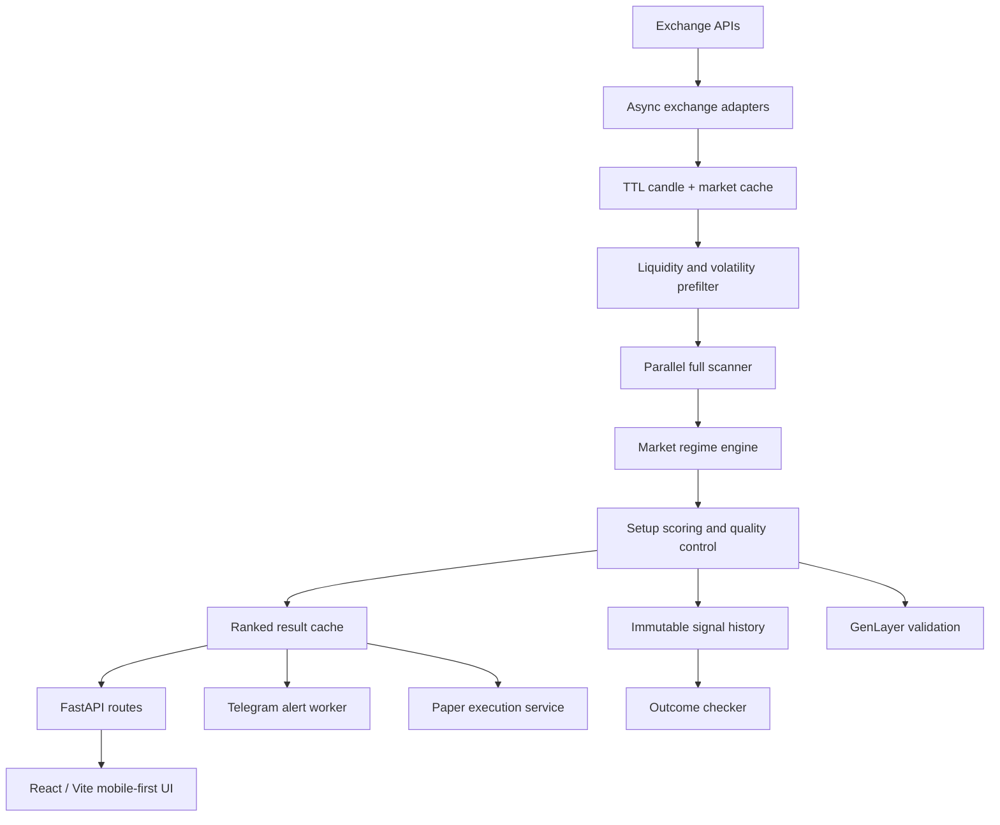

# SwiftChart — Trading Infra Submission

## Project description

SwiftChart is regime-aware signal infrastructure for crypto perpetual markets. It converts exchange candles and market metadata into ranked, risk-defined trade ideas that can be consumed from a web dashboard, API, Telegram bot, validation service, or paper-execution worker.

The core thesis is simple: a pattern is not a trade until its market context, location, invalidation, reward, freshness, and execution risk are explicit. SwiftChart therefore classifies the regime first, scores both directional candidates, rejects poor locations and exhausted moves, and records every published idea for later outcome evaluation.

## Key features

- Dynamic liquid-perpetual market discovery
- Two-stage scanning for efficient infrastructure usage
- Support/resistance and liquidity-sweep analysis
- Trend, range, breakout, breakdown, chop, and transition regimes
- Regime-adjusted 0–100 setup scoring
- Higher-timeframe confirmation
- Minimum RR and risk-based sizing controls
- Late-entry and exhaustion protection
- Ranked signal API and mobile-first React client
- Telegram alerts with eligibility gates and deduplication
- Immutable signal history and candle-based lifecycle tracking
- Paper-first execution with live-trading safety gates
- GenLayer-assisted multi-validator signal review

## Infrastructure architecture

SwiftChart separates market ingestion, analysis, delivery, persistence, and execution so each layer can scale or fail independently.



Operational safeguards include bounded concurrency, rotating market windows, data caching, minimum-liquidity checks, API rate limiting, webhook authentication, duplicate alert fingerprints, stale-signal controls, explicit invalidation, and `LIVE_TRADING_ENABLED=false` by default.

## Usage records summary

The submission includes linked deterministic demo records generated to match the current SwiftChart schema and rules.

| Artifact | Records | Purpose |
|---|---:|---|
| `docs/sample_scan_logs.json` | 50 | Timestamped scans with pair, score, side, timeframe, regime, RR, and result |
| `docs/sample_signal_outputs.json` | 10 | Full risk-defined signal payloads |
| `docs/sample_user_activity.json` | 30 | Privacy-safe web, API, and Telegram interaction events |
| `docs/sample_telegram_alerts.md` | 6 | Human-readable examples linked to scan IDs |

Dataset controls:

- all timestamps are UTC ISO 8601 values;
- accepted setup scores are at least 65;
- every published idea meets or exceeds 2.0R;
- signal and alert examples reference stable scan IDs;
- outcome records use SwiftChart lifecycle/result vocabulary;
- ambiguous same-candle outcomes are not represented as wins;
- fixtures are explicitly marked synthetic and are not claimed as live performance.

## Links

- **Live application:** `[ADD LIVE APP URL]`
- **Public repository:** `[ADD GITHUB REPOSITORY URL]`
- **Demo video:** `[ADD DEMO VIDEO URL]`
- **Telegram bot:** `[ADD TELEGRAM BOT URL]`
- **API documentation:** `[ADD API DOCS URL]`
- **Architecture / pitch deck:** `[ADD DECK URL]`
- **Team contact:** `[ADD CONTACT URL OR EMAIL]`

## Reviewer quick start

```bash
python3 -m json.tool docs/sample_scan_logs.json >/dev/null
python3 -m json.tool docs/sample_user_activity.json >/dev/null
python3 -m json.tool docs/sample_signal_outputs.json >/dev/null

python3 -m venv .venv
source .venv/bin/activate
pip install -r backend/requirements.txt
PYTHONPATH=backend uvicorn app.main:app --port 8000
```

In another terminal:

```bash
cd frontend
npm install
VITE_API_BASE=http://localhost:8000 npm run dev
```

SwiftChart is analysis software, not financial advice. The included evidence is demo data for product review.
