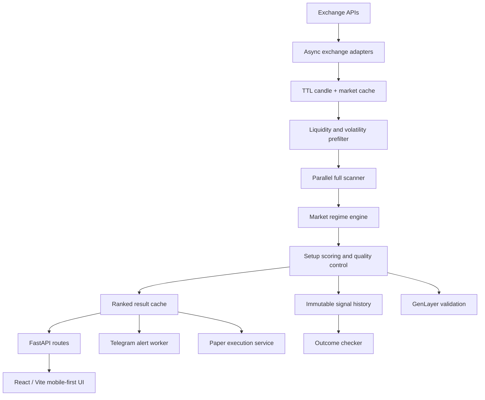

# SwiftChart — Trading Infra Submission

**Hackathon track:** Trading Infra

## Project description

SwiftChart is regime-aware signal infrastructure for crypto perpetual markets.
It converts exchange candles and market metadata into ranked, risk-defined trade
ideas that can be consumed from a web dashboard, API, Telegram bot, validation
service, or paper-execution worker.

The core thesis is simple: a pattern is not a trade until its market context,
location, invalidation, reward, freshness, and execution risk are explicit.
SwiftChart therefore classifies the regime first, scores both directional
candidates, rejects poor locations and exhausted moves, and records every
published idea for later outcome evaluation.

## Key features

- Dynamic liquid-perpetual market discovery
- Two-stage scanning for efficient infrastructure usage
- Support/resistance and liquidity-sweep analysis
- Trend, range, breakout, breakdown, chop, and transition regimes
- Regime-adjusted 0–100 setup scoring
- Higher-timeframe confirmation
- Minimum RR and risk-based sizing controls
- Late-entry and exhaustion protection
- Ranked signal API and mobile-first React client
- Telegram alerts with eligibility gates and deduplication
- Immutable signal history and candle-based lifecycle tracking
- Paper-first execution with live-trading safety gates
- GenLayer-assisted multi-validator signal review

## Infrastructure architecture

SwiftChart separates market ingestion, analysis, delivery, persistence, and
execution so each layer can scale or fail independently.



Operational safeguards include bounded concurrency, rotating market windows,
data caching, minimum-liquidity checks, API rate limiting, webhook
authentication, duplicate alert fingerprints, stale-signal controls, explicit
invalidation, and `LIVE_TRADING_ENABLED=false` by default.

## Verifiable sample input-output records

The repository includes deterministic, synthetic sample records generated to
match SwiftChart's current schemas, scoring rules, risk controls, alert format,
and lifecycle vocabulary. They are provided so judges can inspect and reproduce
the relationship between scanner inputs, signal outputs, product events,
alerts, and recorded result states.

These files are **not live user activity, audited production usage, or live
trading performance**. Prices, timestamps, users, and outcomes are synthetic
demonstration data. Each artifact is explicitly labeled `synthetic_demo`, and
stable `scan_id` values make the sample input-output relationships verifiable
across files.

| Artifact | Records | Purpose |
| --- | ---: | --- |
| [`docs/sample_scan_logs.json`](docs/sample_scan_logs.json) | 50 | Synthetic scan/result records with timestamp, pair, score, side, timeframe, regime, RR, lifecycle status, and result |
| [`docs/sample_signal_outputs.json`](docs/sample_signal_outputs.json) | 10 | Complete risk-defined sample outputs linked to scan records |
| [`docs/sample_user_activity.json`](docs/sample_user_activity.json) | 30 | Synthetic, privacy-safe web/API/Telegram events linked to sample signals |
| [`docs/sample_telegram_alerts.md`](docs/sample_telegram_alerts.md) | 6 | Rendered sample alerts linked to the same stable scan IDs |

Verification controls:

- all timestamps are UTC ISO 8601 values;
- accepted setup scores are at least 65;
- every published idea meets or exceeds 2.0R;
- signal outputs, activity events, and alerts reference stable scan IDs;
- RR values recompute from entry midpoint, stop, and TP2;
- position sizes recompute from the stated fixed sample risk amount;
- outcome records use SwiftChart lifecycle/result vocabulary;
- ambiguous same-candle outcomes are not represented as wins;
- every JSON artifact is machine-parseable and explicitly marked synthetic.

## Links

- **Live application:** [swiftchart.vercel.app](https://swiftchart.vercel.app/)
- **Public GitHub repository:**
  [github.com/OffsetOWS/swiftchart](https://github.com/OffsetOWS/swiftchart)
- **Submission document:**
  [SUBMISSION.md](https://github.com/OffsetOWS/swiftchart/blob/main/SUBMISSION.md)
- **Sample evidence directory:**
  [docs/](https://github.com/OffsetOWS/swiftchart/tree/main/docs)
- **Telegram bot:** [@SwiftChartBot](https://t.me/SwiftChartBot)

## Reviewer quick start

```bash
python3 -m json.tool docs/sample_scan_logs.json >/dev/null
python3 -m json.tool docs/sample_user_activity.json >/dev/null
python3 -m json.tool docs/sample_signal_outputs.json >/dev/null

python3 -m venv .venv
source .venv/bin/activate
pip install -r backend/requirements.txt
PYTHONPATH=backend uvicorn app.main:app --port 8000
```

In another terminal:

```bash
cd frontend
npm install
VITE_API_BASE=http://localhost:8000 npm run dev
```

SwiftChart is analysis software, not financial advice. The included sample
evidence is synthetic input-output data for technical review and must not be
interpreted as live trading performance.
